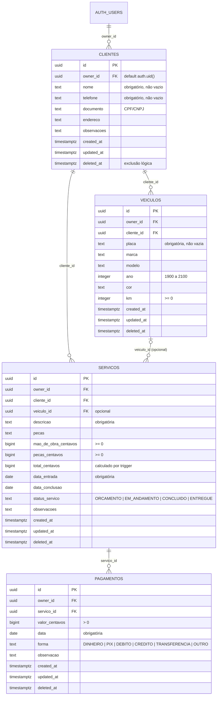

# Banco de dados (Supabase / Postgres)

Fonte da verdade: [`supabase/migrations/`](../supabase/migrations). Testes pgTAP: [`supabase/tests/`](../supabase/tests).

## Diagrama

## Convenções

- **IDs**: `uuid`, gerados no app (`randomUUID`). O banco tem `gen_random_uuid()` só como reserva.
- **Dinheiro**: sempre `bigint` em centavos. Nunca decimais.
- **Datas de negócio** (`data_entrada`, `data_conclusao`, `pagamentos.data`): `date` (dia no fuso `America/Sao_Paulo`, calculado no app). Carimbos técnicos (`created_at`, `updated_at`, `deleted_at`): `timestamptz`.
- **Enums**: `text` com `check` (mais simples de evoluir do que tipos `enum`).
- **Dono**: `owner_id uuid not null default auth.uid()` referenciando `auth.users`. As FKs entre tabelas são **compostas com `owner_id`** (`(cliente_id, owner_id) → clientes(id, owner_id)`), então é impossível pendurar um veículo, serviço ou pagamento em registro de outra conta, mesmo conhecendo o UUID.
- **Índices**: `(owner_id, updated_at)` em todas as tabelas (RLS + consulta incremental do sync), FKs, `clientes(nome)` e `veiculos(owner_id, placa)`.

## Triggers

| Trigger                | Tabelas    | O que faz                                                                                                                                                                                                                                                                            |
| ---------------------- | ---------- | ------------------------------------------------------------------------------------------------------------------------------------------------------------------------------------------------------------------------------------------------------------------------------------ |
| `a_definir_updated_at` | todas      | Em todo `UPDATE`: se o app enviou `updated_at` **mais novo**, mantém; se não enviou (ou enviou o mesmo), o servidor grava `greatest(now(), anterior + 1 ms)`; se enviou **mais antigo**, a escrita é **obsoleta e descartada** (a linha fica como estava — vale também para upsert). |
| `b_calcular_total`     | `servicos` | `total_centavos = mao_de_obra_centavos + pecas_centavos` (nulos viram 0). O total enviado pelo app é ignorado.                                                                                                                                                                       |
| `cascatear_exclusao`   | `clientes` | Quando `deleted_at` passa de nulo para preenchido: marca veículos, serviços e pagamentos do cliente com o mesmo `deleted_at`.                                                                                                                                                        |
| `cascatear_exclusao`   | `servicos` | Idem para os pagamentos do serviço.                                                                                                                                                                                                                                                  |

Itens que já estavam excluídos mantêm a data original. Os filhos atingidos pela cascata ganham `updated_at` novo, para o sync dos outros aparelhos baixar a exclusão.

### Consequência para o sync (fase 03)

O desempate "vence o `updated_at` mais recente" também é garantido no servidor: um upsert com `updated_at` mais antigo que o gravado **não dá erro, mas não altera nada** (o PostgREST devolve 0 linhas para ele). O app deve, depois de enviar, baixar as mudanças (`updated_at > ultimo_sync`) para receber a versão vencedora.

## Segurança

- **RLS ativo** nas 4 tabelas, com políticas `select`/`insert`/`update` para `authenticated` usando `owner_id = auth.uid()` (o `update` também impede trocar o `owner_id`).
- **Sem política de delete** e **sem privilégio de `DELETE`/`TRUNCATE`** para `authenticated`: só exclusão lógica.
- **`anon` não tem privilégio nenhum** nas tabelas e na view.
- Cadastro público desativado (`supabase/config.toml`: `[auth] enable_signup = false` e `[auth.email] enable_signup = false`).

## View `servicos_resumo`

`security_invoker = true` (respeita o RLS de quem consulta). Traz todas as colunas de `servicos` e mais:

| Coluna                | Regra                                                                              |
| --------------------- | ---------------------------------------------------------------------------------- |
| `total_pago_centavos` | soma de `pagamentos.valor_centavos` com `deleted_at is null` (0 se nenhum)         |
| `falta_centavos`      | `max(total_centavos − total_pago_centavos, 0)`                                     |
| `status_pagamento`    | `PAGO` se pago ≥ total (total 0 é `PAGO`); `PENDENTE` se pago = 0; senão `PARCIAL` |

Serviços excluídos logicamente continuam na view (com `deleted_at`); o app filtra.

## CI e deploy

- `.github/workflows/supabase.yml` (push/PR que altere `supabase/**`): `supabase db start` aplica as migrations num banco limpo → `supabase test db` → reaplica as migrations no mesmo banco (idempotência) → `supabase test db` de novo → `supabase db lint`. **Não faz deploy.**
- Deploy no projeto real: feito pelo orquestrador, do Mac (`npx supabase link --project-ref yzxhtjgohhcympttvxri` e `npx supabase db push`). Nenhum token de conta ou senha do banco vai para o GitHub.
- `.github/workflows/keepalive.yml`: a cada 3 dias faz um `select` via REST em `clientes` com os secrets `SUPABASE_URL`/`SUPABASE_ANON_KEY` (resposta 401/404 é aceita; só falha sem resposta ou com 5xx). Pula se os secrets não existirem. Observação: o GitHub desativa workflows agendados após 60 dias sem atividade no repositório.
